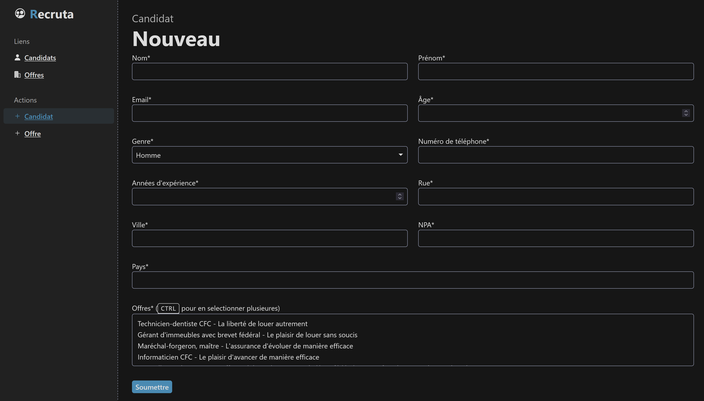

\newpage

# Introduction

Il est parfois compliqué pour les ressources humaines de suivre tous les candidats et offres d'emploi. C'est la problématique que nous avons choisi pour le projet de BDR.

Dans le cadre de ce projet, nous devons :  
1. Écrire le cahier des charges  
2. Modéliser un schéma EA conceptuel de la base de données  
3. Transformer le schéma EA en schéma relationnel et l'implémenter avec Postgresql  
4. Réaliser des requêtes, vues et triggers / procédures stockées  
5. Coder une application et la lier à la base de données via une API  


# Cahier des charges

[Consulter le cahier des charges au format PDF](cahier-des-charges.pdf)

## Objectif de l'application

Développer une application pour permettre aux recruteurs de gérer efficacement
les processus de recrutement, incluant la gestion des candidats, des postes et
des entretiens.

## Fonctionnalités principales

- Gestion des candidats: ajout, modification, suppression, suivi des
  interactions, statut.
- Gestion des offres d'emploi: création, gestion des offres, suivi des
  candidatures.
- Gestion des entretiens: planification et suivi des retours.
- Suivi du processus de recrutement: vue d'ensemble des candidats par poste.
- Authentification de base pour les recruteurs.

# Conception

## Entités Principales

- **Personne**: Entité racine représentant tous les acteurs du système
- **Candidat**: Spécialisation de Personne, représentant les candidats
- **Recruteur**: Spécialisation de Personne, représentant les recruteurs
- **Interaction**: Modélise les différents types de communications
- **Offre**: Représente les opportunités d'emploi
- **Domaine**: Catégorise les compétences et secteurs d'activité

\pagebreak

## Modélisation Conceptuelle (Schéma EA)

<!-- Le principal défi est le tri des candidats par pertinence pour un poste donné. Il faut définir la limite entre ce qui est stocké dans la base de données et ce qui est retrouvé dans le code. Par exemple, comment quantifier l'expérience, ou la localisation ? Faut-il introduire une notion de distance par rapport à la location de l'offre et la location du candidat ? Dans le code ou dans la bdd ?

- profile
- address / lat long
- interactions:enum?
- statut table ou enum ? (historique)
- diplome enum
- expérience int -->


## Modélisation Relationnelle

Le modèle relationnel permet de transformer les informations du schéma EA réalisé précédemment en un langage plus proche du code, sans pour autant en perdre la simplicité.  
Voici la modélisation que nous avons mise en place :  

Personne(\underline{id}, nom, prenom, email)

Recruteur(\underline{idPersonne})  
Recruteur.idPersonne reference Personne.id

Adresse(\underline{id}, latitude, longitude, rue, ville, npa, pays)

Candidat(\underline{idPersonne}, age, genre, numeroTel, anneesExp, idAdresse)  
Candidat.idPersonne reference Personne.id  
Candidat.idAdresse reference Adresse.id Candidat.idAdresse NOT NULL UNIQUE

Recruteur_Candidat(\underline{idRecruteur, idCandidat})  
Recruteur_Candidat.idRecruteur reference Recruteur.idPersonne  
Recruteur_Candidat.idCandidat reference Candidat.idPersonne

Interaction(\underline{id}, date, notesTexte)

Recruteur_Interaction(\underline{idRecruteur, idInteraction})  
Recruteur_Interaction.idRecruteur reference Recruteur.idPersonne  
Recruteur_Interaction.idInteraction reference Interaction.id

Candidat_Interaction(\underline{idCandidat, idInteraction})  
Candidat_Interaction.idCandidat reference Candidat.idPersonne  
Candidat_Interaction.idInteraction reference Interaction.id

Email(\underline{idInteraction}, objet)  
Email.idInteraction reference Interaction.id

Appel(\underline{idInteraction}, duree)  
Appel.idInteraction reference Interaction.id

Entretien(\underline{idInteraction}, typeEntretien, duree)  
Entretien.idInteraction reference Interaction.id

Offre(\underline{id}, descriptionOffre, nomPoste, annneesExpRequises,
datePublication, dateCloture, idAdresse)  
Offre.idAdresse reference Adresse.id  
Offre.idAdresse NOT NULL UNIQUE

Contrat_Travail(\underline{id}, debut, fin, salaireHoraire, idOffre)  
Contrat_Travail.idOffre reference Offre.id  
Contrat_Travail.idOffre NOT NULL, UNIQUE

Candidat_Offre(\underline{idCandidat, idOffre}, datePostulation, statut)  
Candidat_Offre.idCandidat reference Candidat.idPersonne  
Candidat_Offre.idOffre reference Offre.id

Domaine(\underline{id}, nom)

Offre_Domaine(\underline{idOffre, idDomaine}, diplomeRecherche)
Offre_Domaine.idOffre reference Offre.id Offre_Domaine.idDomaine reference
Domaine.id

Candidat_Domaine(\underline{idCandidat, idDomaine}, diplomePossede)
Candidat_Domaine.idCandidat reference Candidat.idPersonne
Candidat_Domaine.idDomaine reference Domaine.id

## Contraintes et Intégrités Référentielles

### Stratégies ON DELETE et ON UPDATE

#### Candidat

```sql
CONSTRAINT FK_Personne
FOREIGN KEY (idPersonne)
REFERENCES Personne(id)
ON DELETE CASCADE
ON UPDATE CASCADE

CONSTRAINT FK_Adresse
FOREIGN KEY (idAdresse)
REFERENCES Adresse(id)
ON DELETE RESTRICT
ON UPDATE NO ACTION
```

- **Personne:** Si une personne est supprimée, le profil de candidat est
  également supprimé. Cela garantit qu'un candidat ne peut pas exister sans une
  identité personnelle de base.
- **Adresse:** L'adresse ne peut pas être supprimée si un candidat y est
  associé, afin de préserver l'intégrité des données historiques.

#### Recruteur

```sql
FOREIGN KEY (idPersonne)
REFERENCES Personne(id)
ON DELETE CASCADE
ON UPDATE CASCADE
```

- Similaire au Candidat: si la personne est supprimée, son profil de recruteur
  est également supprimé.

#### Recruteur_Candidat

```sql
CONSTRAINT FK_Recruteur
FOREIGN KEY (idRecruteur)
REFERENCES Recruteur(idPersonne)
ON DELETE RESTRICT
ON UPDATE CASCADE

CONSTRAINT FK_Candidat
FOREIGN KEY (idCandidat)
REFERENCES Candidat(idPersonne)
ON DELETE RESTRICT
ON UPDATE CASCADE
```

- Empêche la suppression d'un recruteur ou d'un candidat s'il existe des
  relations professionnelles entre eux.
- Autorise la mise à jour des identifiants si nécessaire.

#### Interactions (Emails, Appels, Entretiens)

```sql
FOREIGN KEY (idInteraction)
REFERENCES Interaction(id)
ON DELETE CASCADE
ON UPDATE CASCADE
```

- Les interactions spécialisées (email, appel, entretien) sont supprimées si
  l'interaction parent est supprimée.
- Permet de maintenir la cohérence des types d'interactions.

#### Recruteur_Interaction et Candidat_Interaction

```sql
CONSTRAINT FK_Recruteur/Candidat
FOREIGN KEY (idRecruteur/idCandidat)
REFERENCES Recruteur/Candidat(idPersonne)
ON DELETE RESTRICT
ON UPDATE CASCADE

CONSTRAINT FK_Interaction
FOREIGN KEY (idInteraction)
REFERENCES Interaction(id)
ON DELETE RESTRICT
ON UPDATE CASCADE
```

- Empêche la suppression d'un recruteur ou candidat s'il a des interactions
  historiques.
- Interdit la suppression d'interactions liées à des personnes.

#### Offre

```sql
CONSTRAINT FK_Adresse
FOREIGN KEY (idAdresse)
REFERENCES Adresse(id)
ON DELETE RESTRICT
ON UPDATE NO ACTION
```

- L'adresse associée à une offre ne peut pas être supprimée, préservant la
  localisation historique de l'offre.

#### Contrat_Travail

```sql
CONSTRAINT FK_Contrat_Travail
FOREIGN KEY (idOffre)
REFERENCES Offre(id)
ON DELETE RESTRICT
ON UPDATE NO ACTION
```

- Un contrat ne peut pas être lié à une offre supprimée, garantissant
  l'intégrité des références.

#### Candidat_Offre

```sql
CONSTRAINT FK_Candidat
FOREIGN KEY (idCandidat)
REFERENCES Candidat(idPersonne)
ON DELETE RESTRICT
ON UPDATE CASCADE

CONSTRAINT FK_Offre
FOREIGN KEY (idOffre)
REFERENCES Offre(id)
ON DELETE RESTRICT
ON UPDATE NO ACTION
```

- Empêche la suppression d'un candidat ayant postulé à des offres.
- Interdit la modification de la clé de l'offre une fois les candidatures
  enregistrées.

#### Offre_Domaine et Candidat_Domaine

```sql
CONSTRAINT FK_Offre/Candidat
FOREIGN KEY (idOffre/idCandidat)
REFERENCES Offre/Candidat(id)
ON DELETE RESTRICT
ON UPDATE NO ACTION

CONSTRAINT FK_Domaine
FOREIGN KEY (idDomaine)
REFERENCES Domaine(id)
ON DELETE RESTRICT
ON UPDATE NO ACTION
```

- Préserve l'intégrité des liens entre offres/candidats et domaines.
- Empêche la suppression de domaines sans considérer leurs relations existantes.

Ces choix de contraintes visent à:

- Maintenir l'intégrité référentielle
- Prévenir les suppressions accidentelles
- Conserver un historique fiable
- Permettre des mises à jour contrôlées des données

### Triggers de Validation

#### `check_personne()`

- **Objectif:** Garantir qu'une personne ne peut être créé que si un Candidat ou
  un Recruteur est aussi crée dans la transaction
- **Déclenchement:** Après l'insertion dans la table Personne
- **Action:** Lève une exception si la condition n'est pas respectée

#### `check_personne_exists()`

- **Objectif:** Garantir qu'un Candidat ou un Recruteur ne peut être créé que si
  l'identifiant de personne existe déjà
- **Déclenchement:** Après l'insertion dans les tables Candidat et Recruteur
- **Vérification:** Vérifie que l'`idPersonne` n'est pas null et existe dans la
  table Personne
- **Action:** Lève une exception si la condition n'est pas respectée

#### `check_interaction()`

- **Objectif:** Garantir qu'une interaction ne peut être créé que si une
  interactions spécialisées (Email, Appel, Entretien) est aussi crée dans la
  transaction
- **Déclenchement:** Après l'insertion dans la table Interaction
- **Action:** Lève une exception si la condition n'est pas respectée

#### `check_interaction_exists()`

- **Objectif:** Assurer que les interactions spécialisées (Email, Appel,
  Entretien) sont liées à une interaction principale existante
- **Déclenchement:** Après l'insertion dans les tables Interaction_Email,
  Interaction_Appel, Interaction_Entretien
- **Vérification:** Confirme que l'`idInteraction` n'est pas null et existe dans
  la table Interaction
- **Action:** Lève une exception si la condition n'est pas respectée

#### `check_contrat_embauche()`

- **Objectif:** Empêcher la création d'un contrat de travail sans candidat
  embauché
- **Déclenchement:** Avant l'insertion dans la table Contrat_Travail
- **Vérification:** Vérifie qu'il existe au moins un candidat avec le statut
  'Embauché' pour l'offre
- **Action:** Lève une exception si aucun candidat n'a été embauché

#### `check_fin_after_cloture()`

- **Objectif:** Garantir que la date de fin du contrat est postérieure à la date
  de clôture de l'offre
- **Déclenchement:** Avant l'insertion ou la mise à jour dans la table
  Contrat_Travail
- **Vérification:** Compare la date de fin du contrat avec la date de clôture de
  l'offre
- **Action:** Lève une exception si la date de fin est antérieure ou égale à la
  date de clôture

#### `check_candidat_offre_constraints()`

- **Objectif:** Valider les candidatures selon plusieurs contraintes
  1. Un statut 'Embauché' nécessite une date de clôture d'offre
  2. La date de postulation doit être entre la date de publication et la date de
     clôture de l'offre
- **Déclenchement:** Avant l'insertion ou la mise à jour dans la table
  Candidat_Offre
- **Vérification:**
  - Vérifie la cohérence du statut 'Embauché' avec la date de clôture
  - Contrôle que la date de postulation est dans la période valide de l'offre
- **Action:** Lève une exception si l'une des conditions n'est pas respectée

#### `check_domaine_link()`

- **Objectif:** S'assurer qu'un domaine est lié soit à un candidat, soit à une
  offre
- **Déclenchement:** Après l'insertion ou la mise à jour dans la table Domaine
- **Vérification:** Compte les liens avec des candidats et des offres
- **Action:** Lève une exception si aucun lien n'est trouvé

Tous ces triggers visent à maintenir la cohérence et l'intégrité des données du
système de gestion de candidatures.

### Contraintes Métier

#### Validation d'Âge des Candidats

```sql
CHECK (age >= 16 AND age < 100)
```

- **Objectif:** Garantir un intervalle d'âge réaliste pour les candidats
- **Plage:** Entre 16 et 99 ans
- **Logique:** Exclut les candidats potentiellement trop jeunes ou
  irréalistement âgés

#### Validation des Coordonnées Géographiques (Adresse)

```sql
CHECK (latitude > -90 AND latitude < 90)
CHECK (longitude > -180 AND longitude < 180)
```

- **Objectif:** Assurer des coordonnées géographiques valides
- **Latitude:** Comprise entre -90° et 90° (pôles Nord et Sud)
- **Longitude:** Comprise entre -180° et 180° (méridien de Greenwich)
- **Logique:** Correspond aux limites physiques de la Terre

#### Validation des Dates de Contrat de Travail

```sql
CHECK (fin IS NULL OR fin > debut)
```

- **Objectif:** Garantir la cohérence des dates de contrat
- **Condition:** Si une date de fin est spécifiée, elle doit être postérieure à
  la date de début
- **Flexibilité:** Permet des contrats sans date de fin (contrats indéterminés)

#### Validation du Salaire Horaire

```sql
CHECK (salaireHoraire > 0)
```

- **Objectif:** Assurer un salaire horaire positif
- **Condition:** Le salaire doit être strictement supérieur à zéro
- **Logique:** Exclut les valeurs nulles ou négatives

#### Validation des Dates de Publication et Clôture d'Offre

```sql
CHECK (dateCloture IS NULL OR dateCloture > datePublication)
```

- **Objectif:** Garantir la logique temporelle des offres
- **Condition:** Si une date de clôture existe, elle doit être postérieure à la
  date de publication
- **Flexibilité:** Autorise des offres sans date de clôture

\newpage

# Application

Dans cette section, nous présentons la partie applicative du projet.

L'application est contenue dans un backend, qui sert des pages statiques, et qui
communique avec la base de donnée. Nous avons également un script qui génère un
ficher "seed" SQL avec des données aléatoires.

## Technologies Utilisées

Pour la réalisation de notre application nous avons utilisé la librairie Python
`FastAPI` avec des templates HTML et CSS.

Nous avons utilisé la base de donnée PostgreSQL et containerisé avec Docker.

## Structure de l'Application

Le projet contiens les répertoires suivants:

- `docs/`: contient le schéma EA et le rapport.
- `app/`: contient le cœur de notre application.
- `generator/`: contient un script permettant de générer les données aléatoires.

## Manuel Utilisateur

### Introduction

Les sections suivantes visent à expliquer comment créer, modifier, consulter et
filtrer les données que notre application permet de visualiser. Au premier
démarrage de l'application une quantité suffisante de données sera générée et
automatiquement ajoutée à la base de données. Ceci permettant de tester les
différentes fonctionnalités sans avoir à créer chaque offre ou candidat à la
main.

### Création d'une Offre

Pour ajouter une offre dans la base de données, il faut se rendre sur
`http://localhost:8000/offre-new` ou cliquer sur `+ Offre`. Afin d'être redirigé
sur la page suivante.


On peut renseigner les différents champs nécessaires à la création de l'offre
puis cliquer sur soumettre.

### Liste des Offres

La liste de toutes les offres se trouve à l'url `http://localhost:8000/offres`
que l'on peut accéder en cliquant sur `Offres`.


On peut observer certaines informations sur les offres. Il est également
possible de clôturer une offre si elle est encore ouverte, en cliquant sur
`Clôturer`, ce qui lui assignera la date d'aujourd'hui comme date de clôture.

### Détail d'une Offre

Depuis la page précédente en cliquant sur `Détails` on accède à
`http://localhost:8000/offres/id` avec id le numéro correspondant à l'id de
l'offre.


On obtient ainsi des informations supplémentaires sur l'offre ainsi que la liste
des candidats qui y ont postulé. On a accès au statut des candidats et à leur
score de compatibilité avec l'offre. Le bouton `Tri par score` permet de trier
les candidats ayant postulé à cette offre du meilleur au moins bon score de
compatibilité.

### Modification d'une Offre

Pour modifier les informations d'une offre il faut se rendre sur
`http://localhost:8000/offre/id/edit` avec id le numéro correspondant à l'id de
l'offre que l'on souhaite modifier. Cette page est accessible depuis les
différents boutons `Modifier` que l'on voit dès qu'une offre est affichée à
différents endroits de l'application.


Cela nous redirige sur une page similaire à celle de création d'offre mais avec
les champs pré remplis contenant les informations actuelles de l'offre à
modifier. Une fois les champs modifier, il suffit de cliquer sur `Soumettre`.

### Filtre des Offres

La page `http://localhost:8000/offres` permet de filtrer les offres en y
ajoutant différent query parameters. Soit directement dans l'URL, soit à l'aide
des différents selecteurs fournis.

|                                                                             Interface                                                                             |                  Query parameters                   |
| :---------------------------------------------------------------------------------------------------------------------------------------------------------------: | :-------------------------------------------------: |
|                                                                                                                           |   `?statut=all`, `?statut=open`, `?statut=closed`   |
|                                                                                                                                   | `?datePublication=recent` `?datePublication=oldest` |
|                                                                                                                                 |                   `?name={name}`                    |
| Depuis la page http://localhost:8000/candidats/id, cliquer sur `Voir les postulations` permet de ne voir que les offres auxquelles un certain candidat a postulé. |                 `?idCandidat={id}`                  |

Il est possible de combiner les filtres en utilisant les différents outils de
l'interface ou en séparant les query parameters par des `&`. Notons cependant
qu'il ne faut pas avoir plusieurs fois le même query parameter avec des valeurs
différentes. La barre de recherche permet de chercher une offre par nom, pour
les offres dont le nom est composé de plusieurs mots, cela permet de les
retrouver avec n'importe lequel des mots qui la compose. Par exemple l'offre
Technicien-dentiste pourra être retrouvée en recherchant Technicien, dentiste,
ou encore Technicien-dentiste.

### Création d'un Candidat

Pour ajouter un candidat dans la base de données, il faut se rendre sur
`http://localhost/candidat-new` que l'on peut atteindre en cliquant sur
`+ Candidat`



On rempli les champs requis, et l'on clique sur `Soumettre`. Notons que pour
assigner ce candidat à une offre il faut que l'offre ait été crée précédemment
afin qu'elle figure dans la liste des offres proposées. Il est possible de
l'assigner à plusieurs offres en maintenant la touche `CTRL` en cliquant sur les
différentes offres souhaitées.

### Liste des Candidats

La liste de tout les candidats se trouve sur `http://localhost:8000/candidats`
que l'on peut accéder en cliquant sur `Candidats`.


On peut observer différentes informations sur tout les candidats de la base de
données.

### Détail d'un Candidat

Depuis la page précédente en cliquant sur `Détails` on accède à
`http://localhost:8000/candidats/id` avec id le numéro correspondant à l'id du
candidat.


Cette page nous donne des informations supplémentaires sur le candidat ainsi que
la liste des offres auquel il a postulé et son statut les concernant.

### Modification d'un Candidat

Pour modifier un candidat il faut se rendre sur
`http://localhost:8000/candidat/id/edit` avec id le numéro correspondant à l'id
du candidat que l'on souhaite modifier. On peut facilement atteindre cette page
depuis les divers boutons `Modifier` présents à chaque fois que l'on afficher
des informations pour un candidat.


Cela nous amène sur un formulaire similaire à celui de la création d'un nouveau
candidat mais pour lequel les champs sont pré remplis avec les informations
actuelles du candidat. Une fois les changement souhaités effectués, on clique
sur `Soumettre` pour les rendre effectifs.

### Filtre des Candidats

La page `http://localhost:8000/candidats` permet de filtrer les candidats en y
ajoutant différent query parameters. Soit directement dans l'URL, soit à l'aide
des différents sélecteurs fournis.

|                                                                         Interface                                                                          |                                                              Query parameters                                                              |
| :--------------------------------------------------------------------------------------------------------------------------------------------------------: | :----------------------------------------------------------------------------------------------------------------------------------------: |
|                                                                                                                          |                    `?gender=Homme`, `?gender=Femme`, `?gender=Autre` pouvant être combinés pour avoir plusieurs genres.                    |
|                                                                                                                              | `?minAge={minAge}&maxAge={maxAge}` Si une valeur n'est pas fournie, elle est remplacée par une valeur par défaut : minAge=16 et maxAge=100 |
|                                                                                                                              |                                                   `?minExp={minExp}`, `?maxExp={maxExp}`                                                   |
| Depuis la page `http://localhost:8000/offres/id`, cliquer sur `Voir les candidats` permet de ne voir que les candidats ayant postulé à une certaine offre. |                                                              `?idoffre={id}`                                                               |

Il est possible de combiner les filtres en utilisant les différents outils de
l'interface ou en séparant les query parameters par des `&`. Notons cependant
qu'il ne faut pas avoir plusieurs fois le même query parameter avec des valeurs
différentes, à l'exception de `?gender`

\newpage

# Conclusion

Pour conclure, dans le cadre de ce projet, nous avons conceptualisé et réalisé
une application permettant de faciliter la visualisation et la recherche de
candidats pour une offre d'emploi.

Malgré le temps limité dont nous disposions, nous avons réussi à implémenter de
nombreuses fonctionnalités en mettant l'accent sur la simplicité et
l'efficacité.

Cependant, certaines fonctionnalités prévues n’ont pas pu être développées. Pour
aller plus loin, nous pourrions ajouter des interactions directes entre
candidats et recruteurs, ainsi qu'approfondir les mécanismes de matching entre
candidats et offres.

\newpage

\appendix

# Annexes

## Guide d'Installation et d'Utilisation

Ci-dessous sont les étapes à suivre afin de démarrer et utiliser l'application.

### Avec Docker

Afin de démarrer l'application, naviguez jusqu'au sous-dossier `app` et lancez les conteneurs :  

```bash
docker-compose up --build
```

Ceci va lancer la base de données, la populer et démarrer le serveur web sur le port :  
`http://localhost:8000`.

### Sans Docker

Afin d'installer les dépendances en local, commencez par créer un environnement virutel :

```bash
python3 -m venv .venv
source .venv/bin/activate
```

Puis installez les dépendances :

```bash
pip install -r requirements.txt
```
